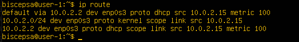
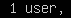

## Part 1. Установка ОС

**Установить Ubuntu 20.04 Server LTS без графического интерфейса. (Используем программу для виртуализации - VirtualBox)**

Версия Ubuntu, с помощью команды `cat /etc/issue`

## Part 2. Создание пользователя

**Создать пользователя, отличного от пользователя, который создавался при установке. Пользователь должен быть добавлен в группу adm.**

Создание пользователя *chefboo* с добавлением в adm

Вывод команды `cat /etc/passwd`

Проверка группы пользователя

## Part 3. Настройка сети ОС

**Для задания названия машины вида *user-1* можно использовать команду**  `sudo hostnamectl set-hostname user-1`  **или провести редактирование в ручную вот так:**

Открываем файл для редактирования в **vim** и сохраняем изменения:

Проверка изменений в файле:

Открываем второй файл для редактирования:

Так же проводим замену второго имени на *user-1*

Перезагружаем машину

**Установка временной зоны, соответствующей моему текущему местоположению**

**Вывод названия сетевых интерфейсов с помощью консольной команды**

lo (*loopback device*) – виртуальный интерфейс, присутствующий по умолчанию в любом Linux. Он используется для отладки сетевых программ и запуска серверных приложений на локальной машине. С этим интерфейсом всегда связан адрес 127.0.0.1. У него есть dns-имя – localhost. Посмотреть привязку можно в файле `/etc/hosts`.

**Используя консольную команду получить ip адрес устройства, на котором работаю, от DHCP сервера.**

Или второй способ:

DHCP - это клиент-серверный протокол динамической конфигурации хоста (Dynamic Host Configuration Protocol), с помощью которого в ИТ-инфраструктуре сетевые параметры каждого нового устройства прописываются автоматически. Использование DHCP существенно упрощает работу системных администраторов в случаях расширения сети.

**Внешний ip-адрес шлюза (ip)**

**Внутренний IP-адрес шлюза, он же ip-адрес по умолчанию (gw)**

**Задать статичные (заданные вручную, а не полученные от DHCP сервера) настройки ip, gw, dns (использовать публичный DNS серверы, например 1.1.1.1 или 8.8.8.8).**

Редактировать значения на статические в файле `/etc/netplan/00-installer-config.yaml`

Применение изменений `sudo netplan apply`

**Перезагружаем машину командой** `sudo reboot`

**Проверяем статичные сетевые настройки (ip, gw, dns)**  `ip route`

Успешно пропинговать удаленные хосты 1.1.1.1 и ya.ru. В выводе команды должна быть фраза "0% packet loss".

## Part 4. Обновление ОС

**Обновить системные пакеты до последней на момент выполнения задания версии.**

Команда для обновления информации о пакетах системы

Команда для установки последних версий пакетов

При повторном объявлении команды:

## Part 5. Использование команды sudo

**Разрешить пользователю, созданному в Part 2, выполнять команду sudo.**

Добавляем пользователя *chefboo* в группу sudo

Устанавливаем пароль для пользователя *chefboo*

Сделаем смену пользователя

Производим замену имени машины как и в Part 2

Перезагружаем машину и проверяем изменения:

**Sudo ( substitute user and do, подменить пользователя и выполнить )**
Sudo – это утилита для операционных систем семейства Linux, позволяющая пользователю запускать программы с привилегиями другой учётной записи, как правило, суперпользователя. В части запуска команд от имени root’а sudo является альтернативой утилите su. Правда, в отличие от su, которая запускает оболочку root’а и предоставляет суперполномочия всем дальнейшим инструкциям, sudo предоставляет только временное повышение привилегий. Таким образом, включая полномочия root’а только когда это действительно необходимо, применение команды sudo снижает вероятность того, что опечатка или ошибка в вызываемой команде причинит какой-нибудь вред системе.

## Part 6. Установка и настройка службы времени

**Настроить службу автоматической синхронизации времени.**

Время, часового пояса, в котором я сейчас нахожусь

Включение автоматической синхронизации времени

Вывод следующей команды должен содержать `NTPSynchronized=yes: 
timedatectl show`

## Part 7. Установка и использование текстовых редакторов

**Установить текстовые редакторы VIM (+ любые два по желанию NANO, MCEDIT, JOE и т.д.)**

**VIM**

**MCEDIT**

**NANO**

**Используя каждый из трех выбранных редакторов, создайте файл test_X.txt, где X -- название редактора, в котором создан файл. Напишите в нём свой никнейм, закройте файл с сохранением изменений.**

**VIM**

Для редактирования необходимо нажать *i* и после этого ввести никнейм. 
Для сохранения результата и выхода надо:
- Нажать ESC
- Ввести *:wq* и нажать ENTER

Проверка:

**MCEDIT**

После ввода никнейма для сохранения надо нажать ESC и в окне выбрать *Да*, а затем нажать ENTER

Проверка:

**NANO**

После ввода никнейма для сохранения надо нажать CTRL + X, затем Y и ENTER

Проверка:

**Используя каждый из трех выбранных редакторов, откройте файл на редактирование, отредактируйте файл, заменив никнейм на строку "21 School 21", закройте файл без сохранения изменений.**

**VIM**

Чтобы выйти без сохранения, нужно ввести *:q!*

Проверка:

**MCEDIT**

Чтобы выйти без сохранения надо нажать ESC и в окне выбрать *Нет*, а затем нажать ENTER.

Проверка:

**NANO**

Чтобы выйти без сохранения, надо нажать CTRL + X, затем N и ENTER.

Проверка:

**Используя каждый из трех выбранных редакторов, отредактируйте файл ещё раз (по аналогии с предыдущим пунктом), а затем освойте функции поиска по содержимому файла (слово) и замены слова на любое другое.**

**VIM**

Для поиска  по содержимому файла необходимо ввести */* и после чего ввести искомое слово и нажать ENTER.

Для замены используется такая команда: :[range]s/{pattern}/{string}/[flags] [count]
Флаг g - заменить все вхождения в текущей строке. Если вы хотите найти и заменить шаблон во всем файле, используйте символ процента % в качестве диапазона. 

**MCEDIT**

Для поиска необходимо нажать F7 и ввести искомую строку и выбрать *Найти все*

Для замены необходимо нажать F4, ввести искомую строку и текст для замены, выбрать *Дальше*

Дальше выбрать *Все* для замены каждого вхождения искомой строки.

**NANO**

Для поиска нажать CTRL + W, а затем ENTER.

Для замены переходим в режим поиска, нажав CTRL + W. Пишем заменяемое слово и  нажимаем CTRL + R, затем пишем слово на которое будем заменять и нажимаем ENTER. На каждом вхождении искомого слова будут спрашивать, заменять ли его. Y - да, N - нет, A - заменить все.

## Part 8. Установка и базовая настройка сервиса SSHD

**Установка службы SSHd**

**Добавление автостарта службы при загрузке системы**

**Перенастроить службу SSHd на порт 2022.**

Открываем файл конфигурации для редактирования

Меняем значение *#Port 22* на _Port 2022_

Перезапускаем службу SSHd

**Используя команду ps, посмотрим наличие процесса sshd.**

Системная утилита _ps_ отвечает за отображение процессов на экране пользователя. Совместно с ней используются команды more, less и grep для фильтрации.

Общий синтаксис команды:

$ `ps опции` или $ `ps опции | grep параметр`

Во втором варианте мы используем утилиту `grep` для того, чтобы отобрать нужные нам процессы по определенному критерию. 

- -A, -e, (a) - выбрать все процессы;
- -a - выбрать все процессы, кроме фоновых;
- -d, (g) - выбрать все процессы, даже фоновые, кроме процессов сессий;
- -N - выбрать все процессы кроме указанных;
- -С - выбирать процессы по имени команды;
- -G - выбрать процессы по ID группы;
- -p, (p) - выбрать процессы PID;
- --ppid - выбрать процессы по PID родительского процесса;
- -s - выбрать процессы по ID сессии;
- -t, (t) - выбрать процессы по tty;
- -u, (U) - выбрать процессы пользователя.

Опции форматирования:

- -с - отображать информацию планировщика;
- -f - вывести максимум доступных данных, например, количество потоков;
- -F - аналогично -f, только выводит ещё больше данных;
- -l - длинный формат вывода;
- -j, (j) - вывести процессы в стиле Jobs, минимум информации;
- -M, (Z) - добавить информацию о безопасности;
- -o, (o) - позволяет определить свой формат вывода;
- --sort, (k) - выполнять сортировку по указанной колонке;
- -L, (H)- отображать потоки процессов в колонках LWP и NLWP;
- -m, (m) - вывести потоки после процесса;
- -V, (V) - вывести информацию о версии;
- -H - отображать дерево процессов;

При использовании опции `-f` команда выдает такие колонки:

- UID - пользователь, от имени которого запущен процесс;
- PID - идентификатор процесса;
- PPID - идентификатор родительского процесса;
- C - процент времени CPU, используемого процессом;
- STIME - время запуска процесса;
- TTY - терминал, из которого запущен процесс;
- TIME - общее время процессора, затраченное на выполнение процессора;
- CMD - команда запуска процессора;
- LWP - показывает потоки процессора;
- PRI - приоритет процесса.

__Перезагрузка системы__

__Вывод команды `netstat -tan`__

Установка утилиты _netstat_

Вывод команды

__Объяснение значения ключей -tan и значения каждого столбца вывода, значения 0.0.0.0:__

Основные параметры:

- -t (--tcp) - показывать только TCP порты.

- -a (--all) - показывать состояние всех сокетов.

- -n (--numeric) - показывать сетевые адреса как числа (например 127.0.0.53:53 вместо localhost:domain)

Значение каждого столбца
- _Proto_: протокол, используемый сокетом (-t -> tcp)
- _Recv-Q_: количество байтов, не скопированных пользовательской программой, подключенной к этому сокету.
- _Send-Q_: количество неподтвержденных байтов удаленного хоста
- _Local Address_: локальный адрес (имя локального хоста) и номер порта сокета. Если не указана опция -n, адрес сокета разрешается в соответствии с полным именем хоста (FQDN), а номер порта преобразуется в соответствующее имя службы.
- _Foreign Address_: удаленный адрес (имя удаленного хоста) и номер порта сокета.
- _State_: состояние сокета.

Виды состояний (_State_):

- ESTABLISHED - соединение установлено
- SYN_SENT - сокет пытается установить соединение
- SYN_RECV - начальная синхронизация соединения
- FIN_WAIT1 - сокет закрыт, ожидание отключения соединения
- FIN_WAIT2 - ожидание отключения удаленной стороны
- TIME_WAIT - ожидание после закрытия повторной передачи отключения удаленной стороны
- CLOSED - соединение закрыто, сокет не используется
- CLOSE_WAIT - удаленный узел отключился, сокет скоро будет закрыт
- LAST_ACK - сначала отключилась удаленная сторона, а затем сокет будет закрыт
- LISTEN - сокет ожидает входящих соединений
- CLOSING - закрытие сокета, точнее сокет закрыт, а затем отключился удаленный узел
- UNKNOWN - состояние сокета неизвестно.

Адрес 0.0.0.0 означает «любой IP данного компьютера» т.е в соединении могут использоваться все IP-адреса существующие на данном компьютере. Адрес 0.0.0.0 обычно означает, что IP адрес ещё не настроен или не присвоен. Такой адрес указывает хост, который обращается к DHCP для получения IP адреса. Адрес 127.0.0.1 - это петлевой интерфейс, используемый в качестве средства IP протокола для взаимодействия между процессами без реальной передачи данных.

Запись _0.0.0.0:*_ обозначает «любой IPv4 адрес с любого порта».
А запись _:::*_  обозначает «любой IPv6 адрес с любого порта».

## Part 9. Установка и использование утилит top, htop

__Установка и запуск утилиты top и htop.__

__TOP__

Установка не потребовалась

Вывод команды:

- uptime      
- количество авторизованных пользователей     
- общая загрузка системы      
- общее количество процессов      
- загрузка cpu      
- загрузка памяти      
- pid процесса занимающего больше всего памяти 

- pid процесса, занимающего больше всего процессорного времени

__HTOP__

Установка

Запуск

**Вывод команды отсортированному по PID, PERCENT_CPU, PERCENT_MEM, TIME**

Сортирока _F6_ 

- по PID

- по PERCENT_CPU

- по  PERCENT_MEM

- по TIME

**Вывод команды отфильтрованному для процесса sshd**

Фильтр _F4_

**Вывод команды  с процессом syslog, найденным, используя поиск**

Поиск _F3_

**Вывод команды  с добавленным выводом hostname, clock и uptime**

Настройка вывода _F2_

## Part 10. Использование утилиты fdisk

**Запустить команду fdisk -l.**

- название жесткого диска
  **/dev/sda**
- его размер
  **30 GiB**
- количество секторов
**62914560**
- swap
**2G**

## Part 11. Использование утилиты df

**Запуск команды df.**

Для корневого раздела (/):

- размер раздела _14339080_
- размер занятого пространства _4696808_
- размер свободного пространства _8892092_
- процент использования _35%_

Единица измерения - _килобайты_

__Запуск команды df -Th.__

Для корневого раздела (/):

- размер раздела - _14G_
- размер занятого пространства - _4,5G_
- размер свободного пространства - _8,5G_
- процент использования - _35%_

тип файловой системы для раздела - _ext4_

ext4 (англ. fourth extended file system, ext4fs) — журналируемая файловая система

## Part 12. Использование утилиты du

**Запуск команды du.**

- Вывод размера папок /home, /var, /var/log (в байтах и в человекочитаемом виде)

- Вывод размера всего содержимого в /var/log (не общее, а каждого вложенного элемента, используя *)

## Part 13. Установка и использование утилиты ncdu

**Установка утилиты ncud**

**Вывод размера папок /home, /var, /var/log**

**du**

/home     /var         /var/log 

124K      541M          61M

**ncud**

/home     /var         /var/log 

124K      600,2M      60,1M

## Part 14. Работа с системными журналами

__Открыть для просмотра:__

1. /var/log/dmesg - содержит информацию о драйверах устройств

2. /var/log/syslog - содержит глобальный системный журнал, в котором пишутся сообщения от ядра Linux, различных служб, сетевых интерфейсов с момента запуска системы

3. /var/log/auth.log - информация об авторизации пользователей, включая удачные и неудачные попытки входа в систему, а также задействованные механизмы аутентификации

**время последней успешной авторизации, имя пользователя и метод входа в систему.**

или можно таким способом:

Последняя авторизация - Wed May 17 15:48

Имя пользователя - biscepsa

Метод входа в систему - LOGIN

__Перезапуск службы SSHd.__

## Part 15. Использование планировщика заданий CRON

**Используя планировщик заданий, запустить команду uptime через каждые 2 минуты.**

Открытие файла конфигураций (настроек)

(При первом использовании выбираем редактор 1-5) В моем случае это nano.

Редактируем файл для добавления задачи

Проверка выполнения задачи планировщиком

Вывод на экран список текущих заданий для CRON.

__Удаление всех заданий из планировщика заданий.__

